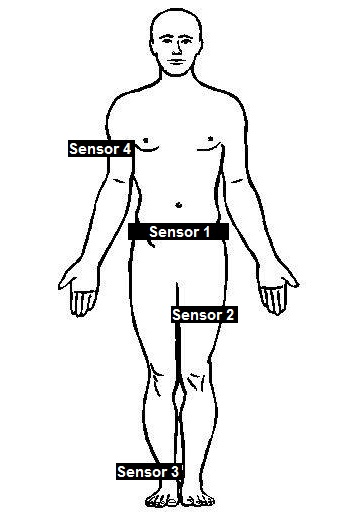

This machine learning project uses the a dataset of a research on Human Activity Recognition (HAR): [Wearable Computing: Classification of Body Postures and Movements (PUC-Rio) Data Set](http://archive.ics.uci.edu/ml/datasets/Wearable+Computing%3A+Classification+of+Body+Postures+and+Movements+%28PUC-Rio%29). 

The dataset contains 5 activity classes (sitting-down, standing-up, standing, walking, and sitting), collected from 4 healthy subjects wearing accelerometers during 8 hours of activities. The sensors were mounted on their waist, left thigh, right arm, and right ankle. The classification uses 12 (x, y, z coordinates of 4 accelerometers) input attributes derived from a time window of 150ms. 



The original research used AdaBoost that combines ten Decision Trees. Their observed classifier accuracy was 99.4%. This project compares the accuracy of 4 models (Distributed Random Forest, Gradient Boosting Method, Neural Networks, and Deep Learning). The model parameters are evaluated via grid search.

# Exploratory Data Analyisis
The original data set is a well formatted coma separated file which does not requires extensive cleaning nor transformation. Though the 4th column was rename from "how\_tall\_in\_meters" to "height". There was only one N/A variable from the 4th sensor on the z coordinate so that observation was removed from the dataset. 

```{r, warning=FALSE}
library(data.table)
library(knitr)
seed <- 2016
set.seed(2016)

data <- read.csv("dataset-har-PUC-Rio-ugulino.csv", sep = ";", stringsAsFactors = FALSE)
setDT(data)
colnames(data)[4] <- "height"
data[, gender := as.factor(gender)]
data[, age := as.integer(age)]
data[, height := as.numeric(gsub(",", ".", height))]
data[, weight := as.integer(weight)]
data[, body_mass_index := as.numeric(gsub(",", ".", body_mass_index))]
data[, x1 := as.integer(x1)]
data[, y1 := as.integer(y1)]
data[, z1 := as.integer(z1)]
data[, x2 := as.integer(x2)]
data[, y2 := as.integer(y2)]
data[, z2 := as.integer(z2)]
data[, x3 := as.integer(y3)]
data[, y3 := as.integer(x3)]
data[, z3 := as.integer(z3)]
data[, x4 := as.integer(x4)]
data[, y4 := as.integer(y4)]
data[, z4 := as.integer(z4)]
data[, class := factor(class)]
data <- data[!is.na(z4)]
```

## Classes
The dataset contains 5 activity classes (sitting-down, standing-up, standing, walking, and sitting). They vary in number of observations related to them. 
```{r, warning=FALSE}
barplot.with.values <- function(values, names.arg, main) {
  names(values) <- names.arg
  bp <- barplot(values, main = main)
  mtext(side = 1, at = bp, text = values, line = 3)
}
class <- data[, .N, by = class]
setkey(class, class)
par(mfrow=c(1,1))
barplot.with.values(class$N, class$class, "Distribution of Classes")
```

## Subjects
The dataset is recorder from 4 healthy subjects (Debora, Jose Carlos, Katia, Wallace). They vary in height, weight, age and number of observations.
```{r, warning=FALSE}
user <- data[,.(Gender = max(gender), 
                Age = max(age), 
                Height = max(height), 
                Weight = max(weight), 
                BMI = max(body_mass_index),
                N = .N), 
             by = user]
setkey(user, user)
kable(user)
par(mfrow=c(1,1))
barplot.with.values(user$N, user$user, "Distribution of Users")
``` 
```{r, warning=FALSE, fig.width=9, fig.height=5}
par(mfrow=c(2,2))
barplot.with.values(user$Age, user$user, "Age")
barplot.with.values(user$Height, user$user, "Height")
barplot.with.values(user$Weight, user$user, "Wight")
barplot.with.values(user$BMI, user$user, "Body Mass Index")

``` 

## Sensors
There are 12 input attributes in total derived from a time window of 150ms. The attributes are the x, y, z coordinates of 4 accelerometers. 

The variance of the sensor values vary during different activity classes. This difference is visible which makes the machine learning promising for classification.  
```{r, warning=FALSE, fig.width=9, fig.height=5}
boxplot.sensor <- function(sensor, title) {
  par(mfrow=c(1,5))
  for (c in class$class) {
    boxplot(value ~ variable, data = sensor[class == c], ylim = c(-300,300), main = c)
  }
  title(title, outer=TRUE)
  par(mfrow=c(1,1))
}
sensor_1 <- melt(data, id.vars = c("user", "class"), measure.vars = c("x1", "y1", "z1"))
sensor_2 <- melt(data, id.vars = c("user", "class"), measure.vars = c("x2", "y2", "z2"))
sensor_3 <- melt(data, id.vars = c("user", "class"), measure.vars = c("x3", "y3", "z3"))
sensor_4 <- melt(data, id.vars = c("user", "class"), measure.vars = c("x4", "y4", "z4"))
```

### Sensor 1 Waist
```{r, warning=FALSE, fig.width=9, fig.height=5}
boxplot.sensor(sensor_1, NULL)
```

### Sensor 2 Left Thigh
```{r, warning=FALSE, fig.width=9, fig.height=5}
boxplot.sensor(sensor_2, NULL)
```

### Sensor 3 Right Ankle
```{r, warning=FALSE, fig.width=9, fig.height=5}
boxplot.sensor(sensor_3, NULL)
```

### Sensor 4 Right Arm
```{r, warning=FALSE, fig.width=9, fig.height=5}
boxplot.sensor(sensor_4, NULL)
```

### 3D
```{r 3D, eval=TRUE, warning=FALSE}
library(scatterplot3d)
par(mfrow=c(1,1))
scatterplot3d(data$x1, data$y1, data$z1, main="Sensor 1")
scatterplot3d(data$x2, data$y2, data$z2, main="Sensor 2")
scatterplot3d(data$x3, data$y3, data$z3, main="Sensor 3")
scatterplot3d(data$x4, data$y4, data$z4, main="Sensor 4")
```


# Supervised Learning Methods
The original dataset contains 165K observations. This data set is divide into train, test and validations sets. 
```{r Sets, warning=FALSE}
#### Training, Validation, and Test sets #### 
N <- nrow(data)
idx_train <- sample(1:N,N/2)
idx_valid <- sample(base::setdiff(1:N, idx_train), N/4)
idx_test <- base::setdiff(base::setdiff(1:N, idx_train),idx_valid)
d_train <- data[idx_train,]
d_valid <- data[idx_valid,]
d_test  <- data[idx_test,]
```

## Mini Batch
Due to long execution of supervised learning methods (around 1 hour per model) using the original dataset, a random mini batch is selected with 20K observations. This mini batch is used for parameter selection via grid search. The method with the selected parameters is executed using the original dataset, so that the different methods can be compared. 
```{r Mini Batch, warning=FALSE}
#### Mini batch for grid search ####
minibatch <- data[sample(1:N, 20000)]
N <- nrow(minibatch)
idx_train <- sample(1:N, 10000)
idx_valid <- sample(base::setdiff(1:N, idx_train), 5000)
idx_test <- base::setdiff(base::setdiff(1:N, idx_train),idx_valid)
mini_train <- minibatch[idx_train,]
mini_valid <- minibatch[idx_valid,]
mini_test  <- minibatch[idx_test,]
rm(N, idx_train, idx_valid, idx_test)
```

## H20
[H2O](http://www.h2o.ai/) is used as machine learning platform. 
```{r H2O Lib, warning=FALSE, message=FALSE, results="hide"}
library(h2o)
```

```{r H2O Init, warning=FALSE}
h2o.init(max_mem_size = "4g", nthreads = -1)   ## starts Java server (R connects via REST)
# h2o.removeAll() # Clean slate - just in case the cluster was already running
```

```{r H2O Data, warning=FALSE, , message=FALSE, results="hide"}
dx_train <- as.h2o(d_train, "train")
dx_valid <- as.h2o(d_valid, "valid")
dx_test <- as.h2o(d_test, "test")

dm_train <- as.h2o(mini_train, "mini_train")
dm_valid <- as.h2o(mini_valid, "mini_valid")
dm_test <- as.h2o(mini_test, "mini_test")

d_x_idxs = 8:ncol(dx_train) - 1
d_y_idxs = ncol(dx_train)

grid.search <- function(algorithm, grid_id, hyper_params = list()){
  grid <- h2o.grid(algorithm, grid_id = grid_id, x = d_x_idxs, y = d_y_idxs, 
                  training_frame = dm_train, validation_frame = dm_valid,
                  hyper_params = hyper_params,
                  stopping_rounds = 5, stopping_tolerance = 1e-3, seed = seed)
}

summarize.grid <- function(grid) {
  print(kable(grid@summary_table))
}

summarize.model <- function(model) {
  params <- data.table(h2o.r2(model, valid = TRUE), h2o.mse(model, valid = TRUE))
  colnames(params) <- c("R Squared", "Mean Squared Error")
  print(kable(params))

  print(kable(h2o.confusionMatrix(model, valid = TRUE)))
  
  try(varimp <- h2o.varimp(model), silent = TRUE)
  if(exists("varimp") & !is.null(varimp)) {
    print(kable(varimp))
  }
}

get.metrics <- function(name, model) {
  r2 <- h2o.r2(model, valid = TRUE)
  mse <- h2o.mse(model, valid = TRUE)
  logloss <- h2o.logloss(model, valid = TRUE)
  list(name = name, r2 = r2, mse = mse, logloss = logloss)
}
```

## Distributed Random Forest (Grid Search)
The default values of the Distributed Random Forest model are 

* Number of trees (ntrees): 50
* Maximum tree depth (max_depth): 20
* For numerical columns - real/int -, build a histogram of - at least - this many bins, then split at the best point (nbins): 20

Grid search is used to find the best parameter in order to find the best parameter. 

### Number of trees
```{r Distributed Random Forest Trees, warning=FALSE, message=FALSE, results="hide"}
drf_ntrees <- grid.search("drf", grid_id = "drf_ntrees", hyper_params = list(ntrees = c(25, 50, 100, 200, 300, 400, 500)))
```

```{r, warning=FALSE, message=FALSE, results="asis"}
summarize.grid(drf_ntrees)
best <- h2o.getModel(drf_ntrees@model_ids[[1]])
summarize.model(best)
```

```{r, warning=FALSE, message=FALSE}
plot(best)
```

#### Conclusion
Based on the scoring history and the summary table **tree number of 200** is used in the final model. 

### Maximum tree depth
```{r Distributed Random Forest Depth, warning=FALSE, message=FALSE, results="hide"}
drf_max_depth <- grid.search("drf", grid_id = "drf_max_depth", hyper_params = list(max_depth = c(10, 15, 20, 25, 30, 40, 50)))
```

```{r, warning=FALSE, message=FALSE, results="asis"}
summarize.grid(drf_max_depth)
best <- h2o.getModel(drf_max_depth@model_ids[[1]])
summarize.model(best)
```

```{r, warning=FALSE, message=FALSE}
plot(best)
```

#### Conclusion
Based on the scoring history and the summary table **maximum tree depth of 40** is used in the final model. 

### Number of bins
```{r Distributed Random Forest Bins, warning=FALSE, message=FALSE, results="hide"}
drf_nbins <- grid.search("drf", grid_id = "drf_nbins", hyper_params = list(nbins = c(10, 20, 30, 40, 50, 60, 70, 80, 90, 100, 200, 400)))
```

```{r, warning=FALSE, message=FALSE, results="asis"}
summarize.grid(drf_nbins)
best <- h2o.getModel(drf_nbins@model_ids[[1]])
summarize.model(best)
```

```{r, warning=FALSE, message=FALSE}
plot(best)
```

#### Conclusion
Based on the scoring history and the summary table **number of bins of 60** is used in the final model. 

### Best Model
```{r Distributed Random Forest Final, warning=FALSE, message=FALSE, results="hide", cache=TRUE}
try(drf <- h2o.getModel("drf"), silent = TRUE)
if (!exists("drf")) {
  drf <- h2o.randomForest(model_id = "drf", x = d_x_idxs, y = d_y_idxs, 
            training_frame = dx_train, validation_frame = dx_valid,
            mtries = -1, ntrees = 200, max_depth = 40, nbins = 60,
            stopping_rounds = 5, stopping_tolerance = 1e-3, seed = seed)
}
```

```{r, warning=FALSE, message=FALSE, results="asis"}
summarize.model(drf)
```

```{r, warning=FALSE, message=FALSE}
plot(drf)
summary(drf)
```

## Gradient Boosting Method (Grid Search)
The default values of the Distributed Random Forest model are 

* Number of trees (ntrees): 50
* Maximum tree depth (max_depth): 5
* For numerical columns - real/int -, build a histogram of - at least - this many bins, then split at the best point (nbins): 20
* Learning rate (learn_rate): 0.1

Grid search is used to find the best parameter in order to find the best parameter. 

### Number of trees
```{r Gradient Boosting Method Trees, warning=FALSE, message=FALSE, results="hide"}
gbm_ntrees <- grid.search("gbm", grid_id = "gbm_ntrees", hyper_params = list(ntrees = c(25, 50, 100, 200, 300, 400, 500)))
```

```{r, warning=FALSE, message=FALSE, results="asis"}
summarize.grid(gbm_ntrees)
best <- h2o.getModel(gbm_ntrees@model_ids[[1]])
summarize.model(best)
```

```{r, warning=FALSE, message=FALSE}
plot(best)
```

#### Conclusion
Based on the scoring history and the summary table **tree number of 300** is used in the final model. 

### Maximum tree depth
```{r Gradient Boosting Method Depth, warning=FALSE, message=FALSE, results="hide"}
gbm_max_depth <- grid.search("gbm", grid_id = "gbm_max_depth", hyper_params = list(max_depth = c(10, 20, 30, 40, 50, 60, 70, 80, 90, 100, 110, 120, 130, 140, 150)))
```

```{r, warning=FALSE, message=FALSE, results="asis"}
summarize.grid(gbm_max_depth)
best <- h2o.getModel(gbm_max_depth@model_ids[[1]])
summarize.model(best)
```

```{r, warning=FALSE, message=FALSE}
plot(best)
```

#### Conclusion
Based on the scoring history and the summary table **maximum tree depth of 110** is used in the final model. 

### Number of bins
```{r Gradient Boosting Method Bins, warning=FALSE, message=FALSE, results="hide"}
gbm_nbins <- grid.search("gbm", grid_id = "gbm_nbins", hyper_params = list(nbins = c(10, 20, 30, 40, 50, 60, 70, 80, 90, 100, 200, 400)))
```

```{r, warning=FALSE, message=FALSE, results="asis"}
summarize.grid(gbm_nbins)
best <- h2o.getModel(gbm_nbins@model_ids[[1]])
summarize.model(best)
```

```{r, warning=FALSE, message=FALSE}
plot(best)
```

#### Conclusion
Based on the scoring history and the summary table **number of bins of 60** is used in the final model. 

### Learning rate
```{r Gradient Boosting Method Rate, warning=FALSE, message=FALSE, results="hide"}
gbm_rate <- grid.search("gbm", grid_id = "gbm_rate", hyper_params = list(learn_rate = c(0.01, 0.05, 0.1, 0.2, 0.3, 0.4, 0.5, 0.6, 0.7, 0.8)))
```

```{r, warning=FALSE, message=FALSE, results="asis"}
summarize.grid(gbm_rate)
best <- h2o.getModel(gbm_rate@model_ids[[1]])
summarize.model(best)
```

```{r, warning=FALSE, message=FALSE}
plot(best)
```

#### Conclusion
Based on the scoring history and the summary table **learning rate of 0.5** is used in the final model. 

### Best Model
```{r Gradient Boosting Method Final, warning=FALSE, message=FALSE, results="hide", cache=TRUE}
try(gbm <- h2o.getModel("gbm"), silent = TRUE)
if (!exists("gbm")) {
  gbm <- h2o.gbm(model_id = "gbm", x = d_x_idxs, y = d_y_idxs, 
            training_frame = dx_train, validation_frame = dx_valid,
            ntrees = 300, max_depth = 110, nbins = 60, learn_rate = 0.5,
            stopping_rounds = 5, stopping_tolerance = 1e-3, seed = seed)
}
```

```{r, warning=FALSE, message=FALSE, results="asis"}
summarize.model(drf)
```

```{r, warning=FALSE, message=FALSE}
plot(drf)
summary(drf)
```


## Deep Learning (Grid Search)
The default values of the Distributed Random Forest model are 

* Activation function (activation): Rectifier
* Hidden layer sizes (hidden): 200, 200
* How many times the dataset should be iterated (epochs): 10

Grid search is used to find the best parameter in order to find the best parameter. 

### Activation function
```{r Deep Learning Activation, warning=FALSE, message=FALSE, results="hide"}
deeplearning_activation <- grid.search("deeplearning", grid_id = "deeplearning_activation", hyper_params = list(activation = c("Tanh", "TanhWithDropout", "Maxout", "MaxoutWithDropout", "Rectifier", "RectifierWithDropout")))
```

```{r, warning=FALSE, message=FALSE, results="asis"}
summarize.grid(deeplearning_activation)
best <- h2o.getModel(deeplearning_activation@model_ids[[1]])
summarize.model(best)
```

```{r, warning=FALSE, message=FALSE}
plot(best)
```

#### Conclusion
Based on the scoring history and the summary table **activation of Tanh** is used in the final model. 

### Hidden layer size
```{r Deep Learning Hidden, warning=FALSE, message=FALSE, results="hide"}
deeplearning_hidden <- grid.search("deeplearning", grid_id = "deeplearning_hidden", hyper_params = list(hidden = c(c(100, 100), c(200, 200), c(300, 300), c(400, 400))))
```

```{r, warning=FALSE, message=FALSE, results="asis"}
summarize.grid(deeplearning_hidden)
best <- h2o.getModel(deeplearning_hidden@model_ids[[1]])
summarize.model(best)
```

```{r, warning=FALSE, message=FALSE}
plot(best)
```

#### Conclusion
Based on the scoring history and the summary table **hidden layer size of 200** is used in the final model. 

### Epoch
```{r Deep Learning Epoch, warning=FALSE, message=FALSE, results="hide"}
deeplearning_epoch <- grid.search("deeplearning", grid_id = "deeplearning_epoch", hyper_params = list(epochs = c(10, 20, 30, 40, 50, 60, 70, 80, 90, 100)))
```

```{r, warning=FALSE, message=FALSE, results="asis"}
summarize.grid(deeplearning_epoch)
best <- h2o.getModel(deeplearning_epoch@model_ids[[1]])
summarize.model(best)
```

```{r, warning=FALSE, message=FALSE}
plot(best)
```

#### Conclusion
Based on the scoring history and the summary table **epoch of 30** is used in the final model. 

### Best Model
```{r Deep Learning Final, warning=FALSE, message=FALSE, results="hide", cache=TRUE}
try(deeplearning <- h2o.getModel("deeplearning"), silent = TRUE)
if (!exists("deeplearning")) {
  deeplearning <- h2o.deeplearning(model_id = "deeplearning", x = d_x_idxs, y = d_y_idxs, 
            training_frame = dx_train, validation_frame = dx_valid,
            activation = "Tanh", hidden = c(200,200), epochs = 30,
            stopping_rounds = 5, stopping_tolerance = 1e-3, seed = seed)
}

```


```{r, warning=FALSE, message=FALSE, results="asis"}
summarize.model(deeplearning)
```

```{r, warning=FALSE, message=FALSE}
plot(deeplearning)
summary(deeplearning)
```

# Comparsion
```{r Comparsion, warning=FALSE, message=FALSE}
models <- data.frame(get.metrics("Distributed Random Forest", drf))
models <- rbind(models, data.frame(get.metrics("Gradient Boosting Method", gbm)))
models <- rbind(models, data.frame(get.metrics("Deep Learning", deeplearning)))
kable(models)
```

## Gradient Boosting Method
The __Gradient Boosting Method__ performs the best out of the three model. It has the accuracy of 99.29% which is close to the accuracy of the original research (99.4%).
```{r Performance, warning=FALSE, message=FALSE}
performance <- h2o.performance(gbm, newdata = dx_test)
kable(data.frame(get.metrics("Performance", performance)))
print(kable(h2o.confusionMatrix(performance)))
```


## Improvments
Further improvements could be included into the models: 

* More sophisticated grid search approach in order to fine tune the parameters
* Using ensemble models, i.e. one-one model for each of the sensors, and a final model to choose from the separate outcomes. 
